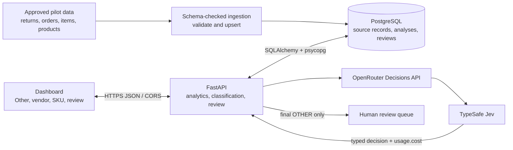

# 10-Minute Client Pitch Script

## Audience

Primary persona: Head of Category Operations or Returns Operations, who owns return-reason taxonomy, review workload, and the operating decision. Executive sponsor: Head of Merchandising or COO. Product/Data Engineering and Privacy/Security are delivery partners, not the primary buyer.

## Before the Meeting

Use the current `audit-updates` Preview URL supplied for the session, and confirm the API is connected before showing records. The demo contains synthetic/sample data only. If Preview is unavailable, skip the live walkthrough rather than implying that the counts are Dhaga production results.

The shortlist and business figures below are reproduced from client-supplied material; they have not been independently audited. The proposed six-week roadmap is indicative and depends on sample access, reviewer capacity, and security approval.

## Timed Script

### Slide 1 — Return Root-Cause Intelligence (0:00–0:30)

“Thanks for the time. I’m speaking to Category Operations because this is a category decision problem first: teams need to understand why products come back, not just count the returns. Our proposal is a narrow, measurable pilot to test whether structured AI classification can make the ‘Other’ bucket more useful without removing human oversight. Today I’ll show the priority, the current workflow, how it fits together, and the decision we need to start safely.”

### Slide 2 — Business Case (0:30–1:30)

“The working figures in the discovery material are 48,000 weekly orders and a 31% return rate, or about 14,880 returns a week. If 44% are marked ‘Other,’ that implies roughly 6,550 returns a week without a useful top-level cause. The material also reports repeat purchase at 22% for six quarters. That is important business context, but we are not claiming that returns caused the retention result. These are reported inputs to validate, not results from this synthetic demo. The pilot should establish the actual volume and whether a reliable cause can be recovered.”

### Slide 3 — Ranked Shortlist (1:30–2:30)

“This is the supplied problem ranking, reproduced as provided. Return and Root-Cause Intelligence is ranked first at 24 out of 25, with the rationale citing return volume, the ‘Other’ share, and size-chart mismatch. SKU go-live automation is second; support intelligence and product analytics follow. We have kept the scores and ordering exactly as supplied, including the stated rationale. We should validate the underlying evidence and avoid reading the cited repeat-purchase relationship as proven causation. The reason to start here is that this problem is close to active category operations and can be tested with a bounded sample.”

### Slide 4 — Updated Dashboard (2:30–3:30)

“The dashboard now separates three questions. First, what AI diagnoses are present in source-‘Other’ comments? That view includes only latest predictions not sent for human review; pending and reviewed cases are excluded. Second, which vendors have higher returned-units-to-sold-units rates? That ranking is unchanged. A separate pie shows the returned-unit share for each vendor in the comparison list and groups omitted vendors as ‘Others.’ Third, which SKUs and issue categories merit investigation? The review queue is opened on demand from its pending count, with batch classification inside it. These are operational signals, not causal findings.”

### Slide 5 — Preview Demo (3:30–5:00)

“On Preview, I’ll first confirm the API connection. In the ‘Other’ view, note that human-review cases are excluded from AI diagnosis coverage. In Vendors, the ranking remains returned units divided by sold units; the pie has a different denominator: returned units across all vendors. Listed vendors appear individually, and those outside the list are combined as ‘Others.’ In SKU drivers, we can inspect the current issue mix and return-ranked products. Finally, the pending count opens the review queue, where the batch action is available; Back to dashboard closes it. The demo uses synthetic/sample records, so we’ll use approved client data only after the pilot gates are met.”

### Slide 6 — High-Level Architecture (5:00–6:15)

“Data enters through schema-validated ingestion and is stored in PostgreSQL. The dashboard calls a FastAPI service for summaries, deterministic analytics, review actions, and batch classification. For classification, the API makes one structured Jev decision request per return through OpenRouter. Jev returns the category/subcategory choice and sentiment; the API records the latest analysis. Final ‘Other’ outcomes enter the human-review queue; valid specific labels are auto-resolved under the current policy. OpenRouter's response includes `usage.cost`, but the current classifier does not capture or persist that field. Instrumenting it is part of making pilot cost measurable. The current demo is not connected to Dhaga production systems.”

### Slide 7 — Delivery Roadmap (6:15–7:45)

“This is an indicative six-week sequence, not a committed delivery date. Week zero is alignment: name the sponsor, select one initial category slice, agree the metrics, and begin privacy and security review. Weeks one and two are data and labels: approve a de-identified sample, map fields, and prepare a representative human-labeled holdout. Weeks three and four are build and baseline: load the approved data into Preview, run Jev-only classification, and measure accuracy, coverage, review volume, and actual usage cost. Weeks five and six are a controlled pilot with weekly quality and operations review. At the exit gate, we decide to expand, iterate, or stop. No broader automation should follow unless the agreed quality and operational thresholds pass.”

### Slide 8 — Old vs. Jev Cost (7:45–9:00)

“The cost comparison uses the same 14,880 returns per week. The v2 estimate was about $5.65 per week for the GPT-4.1 Mini first pass plus a GPT-4.1 escalation on an assumed 10% of cases, using the token counts and prices shown in that deck. The current Jev-only scenario uses the verified rate of $0.042 per million input tokens, with output tokens free. At an assumed 1,000 input tokens per return, that is about $0.000042 per call, or $0.62 per week; 500 to 1,500 input tokens gives roughly $0.31 to $0.94 per week. That is an illustrative model-only comparison, about 89% lower at the midpoint, not a measured bill or a guaranteed saving. It excludes retries and infrastructure. We should record actual `usage.cost` in the pilot before setting a budget.”

### Slide 9 — Pilot Decision (9:00–10:00)

“The ask is to name a Category Operations sponsor and agree the first category slice, a safe sample, and reviewer availability. Product/Data Engineering can then scope the ingestion and cost instrumentation with Privacy/Security. Before the pilot begins, we need a human-labeled holdout and an agreed pass bar for accuracy, usable-cause coverage, review rate, and cost. At the end of the controlled pilot, the sponsor decides whether to expand, revise the labels or workflow, or stop. Can we identify the sponsor and schedule the scoping session?”

## Cost Reference

- Jev input rate used: `$0.042 per 1,000,000 input tokens`; output tokens are free. OpenRouter's Jev documentation says each response reports `usage.cost`: <https://openrouter.ai/docs/guides/community/jev>.
- Jev scenario: `$0.042 / 1,000,000 × 1,000 input tokens × 14,880 returns = $0.62496/week`.
- Sensitivity: 500 tokens/return = `$0.31/week`; 1,500 tokens/return = `$0.94/week`.
- Prior v2 scenario: `$0.00038/return × 14,880 = $5.6544/week`, or about `$5.65/week`.
- Midpoint reduction: approximately `89%`, for model calls only. Actual Jev input-token volume and bills must be measured; the app does not yet persist per-call usage.
