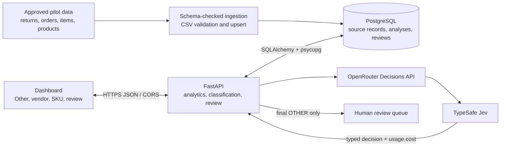
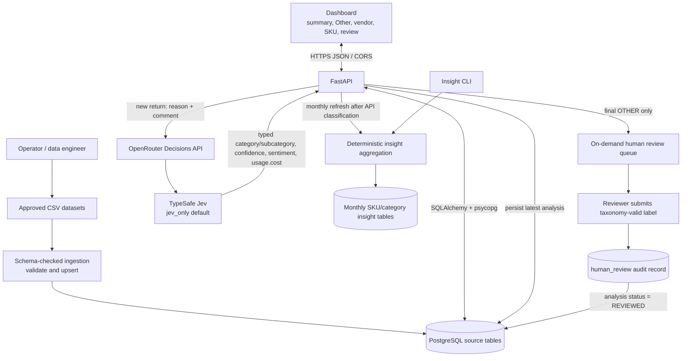

# Dhaga & Co. Return Root-Cause Intelligence — Architecture

**Status:** MVP architecture as implemented in this repository. This document describes the current code and deployment model; it is not a target-state design. Confirm Preview deployment and environment settings in Vercel before relying on the dated operational snapshot in the README.

## 1. Purpose and scope

The application gives Dhaga & Co. a workflow to load operational data, classify apparel return comments with Jev, route final `OTHER` results to human review, and inspect return, vendor, and SKU analytics. It is an FDE MVP for discovery and validation, not a production-hardened multi-tenant analytics platform.

The system deliberately separates three kinds of work:

1. **Operational data loading:** validated CSVs are upserted into relational tables.
2. **Text classification:** the default Jev-only flow makes one structured decision request for each new return and persists the result. An optional legacy two-stage mode remains configurable.
3. **Insight calculation:** deterministic Python/SQL aggregation calculates order-cohort rates. Dashboard analytics are queried live; persisted monthly insight rows are refreshed by API classification or explicitly by the CLI. Neither path calls a model for aggregation.

## 2. System context



The frontend and API are separate Vercel projects. The browser calls the API directly; there is no frontend server-side proxy. API keys and database credentials remain server-side. GitHub Actions runs the Python CI workflow. Vercel Preview deployments are associated with `audit-updates`; Production is associated with `main`. The diagram shows the logical application flow; Preview and Production use separately scoped databases and environment variables.

## 3. Runtime components

### Static web client

`frontend/public/index.html`, `styles.css`, and `app.js` implement the browser UI. The client has no JavaScript framework or bundler. It reads the build-configured API origin and calls the REST endpoints with `fetch`. It renders summary metrics, AI-only source-`Other` diagnoses, vendor rate comparisons and returned-unit shares, SKU issue drivers, and the pending review queue. The queue is opened from the pending count; batch classification controls are inside it. The UI reports API/model failures visibly.

### API

Root `index.py` exports `app.api:app` for Vercel. `app/api.py` defines FastAPI routes, CORS policy, Pydantic request validation, database dependencies, and cached construction of the classifier service. The API is stateless between invocations; PostgreSQL holds durable state.

| Method | Route | Responsibility |
| --- | --- | --- |
| `GET` | `/health` | Lightweight liveness response; does not prove database or model connectivity. |
| `GET` | `/api/dashboard/summary` | Counts orders, returns, literal `Other` returns, analyzed returns, and pending reviews. |
| `GET` | `/api/dashboard/analytics?start=&end=&limit=` | Computes source-`Other` AI diagnoses, vendor returned/sold rates and returned-unit shares, and SKU issue drivers. Date filters are optional at the API; the current dashboard requests the default cohort. |
| `GET` | `/api/dashboard/sku-insights?limit=` | Reads stored SKU insight rows, ordered by newest period and return rate. |
| `GET` | `/api/dashboard/category-insights?limit=` | Reads stored category/subcategory insights. |
| `GET` | `/api/reviews/pending?limit=` | Reads pending AI analyses joined to source return text. |
| `POST` | `/api/returns/{return_id}/classify` | Returns the latest existing analysis or classifies and saves a new one. |
| `POST` | `/api/returns/classify-batch?limit=` | Classifies up to five currently unanalysed returns sequentially and refreshes their monthly insights. |
| `POST` | `/api/reviews/{analysis_id}` | Validates a human label, records the review, and updates analysis status. |
| `POST` | `/api/dashboard/refresh-insights` | Recalculates stored SKU/category insight tables from source data. |

The insight endpoints read materialized rows; they do not calculate or refresh insights. Limits are bounded by API validation. The classification route is idempotent for an already analyzed return in the sense that it returns the latest row rather than issuing another model call.

### Classification service

`app/ai/classifier.py` owns the taxonomy, structured result validation, model routing, and persistence. A result includes category, subcategory, confidence, extracted issue, sentiment, and evidence text. Pydantic rejects fields outside the schema and checks that the subcategory belongs to the selected category.

`CLASSIFICATION_MODE=jev_only` (the default) sends the source reason and customer text directly to Jev once using OpenRouter's Decisions API (`/api/alpha/decisions`). The configured model defaults to `typesafe/jev-1.13`; one response returns the category/subcategory choice, confidence, sentiment, and `usage.cost`. Jev does not return free-form evidence spans, so `extracted_issue` and `evidence_text` remain empty. `CLASSIFICATION_MODE=two_stage` is an optional legacy mode: it runs the light chat model first and calls the selected second-stage model when confidence is below `0.75` or the category is `OTHER`; that model receives the original return text plus the first structured prediction. The taxonomy includes `CUSTOMER_PREFERENCE/CHANGED_MIND` for explicit changed-mind reasons. The source fields sent to a model are only `return_reason` and `return_reason_text`; human labels are never model input. After the final result, only `OTHER` receives `PENDING`; specific taxonomy results receive `NOT_REQUIRED` even at low confidence. Confidence remains stored for monitoring and evaluation.

Jev is called with the OpenRouter API key; OpenRouter includes `usage.cost` in its response, but the current classifier does not capture or persist that field. In two-stage mode, the integration uses LangChain's `ChatOpenAI` with OpenRouter's OpenAI-compatible endpoint and JSON-schema structured output. The model name/version persisted is the configured model alias, not a provider build identifier. Classification/model errors do not create an analysis row. The API maps classification failures to a visible `502`; unavailable database/model paths may return `503`.

### Ingestion and batch operations

`app/ingestion/csv_loader.py` maps CSV headers to SQLAlchemy model columns, validates required and unexpected fields, parses typed values, and merges rows. One dataset is loaded per transaction; datasets commit independently. Run parent datasets before dependent datasets. The CLI is `python -m app.ingestion.cli`.

`scripts/generate_synthetic_data.py` creates the deterministic synthetic MVP files described in `sample_data/dhaga_synthetic_mvp/README.md`. Synthetic data is fictional and belongs in staging/test environments only.

`app/ai/cli.py` supports offline/batch classification. `app/ai/evaluate.py` runs the small labelled text-case evaluation. `app/insights/cli.py` runs deterministic insight aggregation for an explicit inclusive start and exclusive end date.

## 4. Data architecture

The ORM schema is in `app/db/models.py`; migrations are in `migrations/versions/`. PostgreSQL is the system of record for source rows, AI results, review outcomes, and calculated insight rows. Important entity groups:

| Group | Tables | Purpose / key relationships |
| --- | --- | --- |
| Customer and catalogue | `customers`, `vendors`, `products`, `product_size_chart`, `catalogue_attributes` | Customer and vendor masters; SKU details; vendor-linked sizing; optional normalized/product attributes. Product rows reference vendors. |
| Commerce | `orders`, `order_items`, `order_status_history`, `returns`, `reviews` | Orders reference customers; items reference orders and products; returns reference customer/order/product and a composite `(order_item_id, order_id)` relationship. |
| Operational signals | `vendor_purchase_orders`, `support_tickets`, `app_search_events` | Vendor procurement and lead-time records, customer support conversations, and raw app search behavior. |
| Intelligence | `return_ai_analysis`, `human_review`, `sku_return_insights`, `category_return_insights` | Model output and human adjudication, plus precomputed SKU/category aggregates. |

UUID primary keys are used for AI analysis and human review records. Source/business identifiers are generally strings. PostgreSQL `JSONB` stores `top_problem_skus`. The schema retains free-text colour, fabric, and return reason values; ingestion trims whitespace but does not normalize spelling or vocabulary. These values need approved mapping rules before canonical trend analysis.

### Insight semantics

Insights use an **order-created cohort**: returns are assigned to the period of their original order. Supported grains are day, week, and month; the period start is stored in `analysis_period`. The optional API date range is inclusive at `start` and inclusive at `end` for dashboard analytics; the CLI aggregation range uses its documented start-inclusive/end-exclusive semantics. Rates are ratios (0–1) using distinct orders as denominator; issue rates use the same order denominator. The latest AI analysis for a return contributes issue labels, while unanalyzed returns still contribute to total return counts. The dashboard's `GET /api/dashboard/analytics` computes grouped analytics directly. Single and batch API classification refresh the affected monthly persisted insights; CLI classification does not, so rerun the insight CLI after a CLI batch. Human-review submissions do not recalculate insights.

## 5. Core request and data flows

### Ingestion, LLM classification, and insight lifecycle



#### How to read the diagram

- **Ingestion:** The operator supplies approved CSV files. The loader checks their schema and parses values before upserting rows. Load parent tables before dependent tables (for example, customers/vendors/products before orders and returns). Each dataset commits separately, so a later dataset failure does not roll back earlier successful datasets.
- **Classification:** The API reuses the latest saved analysis when available. Otherwise, in the default Jev-only mode it sends one Decisions request through OpenRouter, validates the returned taxonomy choice, and persists the result. Only final `OTHER` results are marked `PENDING`; specific labels are `NOT_REQUIRED` even at low confidence. The optional legacy `two_stage` mode remains available through configuration. CLI reclassification can append a fresh analysis without deleting prior history.
- **Human review:** A reviewer submits a taxonomy-valid label. The system records the AI prediction, human label, reviewer ID, optional comment, and whether the two labels match. The analysis is then marked `REVIEWED`. Review data is an audit trail; it is not fed back into model inference.
- **Insights:** Dashboard analytics group source data live. API single and batch classification also refresh the affected monthly persisted insight rows. The insight CLI recalculates stored rows for an explicit range and grain; CLI classification does not refresh them, and human-review submissions do not recalculate them.
- **External model boundary:** OpenRouter is called only for classification. CSV ingestion, human review persistence, insight aggregation, and dashboard reads are normal application/database operations and do not invoke an LLM.

### Dashboard read

1. Browser calls the summary and live analytics endpoints; opening the on-demand queue loads pending reviews.
2. FastAPI opens a SQLAlchemy session for each request.
3. The API reads source records, latest AI analyses, and review records from PostgreSQL; analytics are aggregated for the request.
4. JSON responses are rendered by the static client.

Summary and dashboard analytics are based on current source records. The separate SKU/category materialized insight endpoints expose stored rows, which may differ in freshness because refresh is explicit for CLI runs.

### Classify one return

1. API resolves the return ID; unknown IDs return `404`.
2. If an analysis already exists, API returns the newest analysis without spending model tokens.
3. Otherwise, default Jev-only classification sends the source reason/comment to OpenRouter's Decisions API in one request. The optional `two_stage` mode uses the configured light model and may escalate.
4. Pydantic validates the output and category/subcategory pair. Jev returns no free-form evidence span, so extracted issue and evidence remain empty in this mode.
5. The API persists `return_ai_analysis` and refreshes that return's monthly insights.
6. Only a final `OTHER` result is queued as `PENDING`; a specific label is `NOT_REQUIRED`, regardless of confidence.
7. The frontend displays the category, confidence, and review state.

### Human review

1. The reviewer chooses a taxonomy-valid category/subcategory and supplies a reviewer ID and optional comment.
2. The API validates the pair against the same taxonomy.
3. The API stores `human_review`, including AI prediction, human label, and whether they match.
4. The analysis is marked `REVIEWED` and its `human_label` is set.

Human review is currently an audit record and status update; it does not automatically recalculate insights or train/tune a model.

### Load and aggregate data

1. Operator points the CLI at a CSV and configured database.
2. Loader validates headers and values, merges rows, and commits that dataset.
3. The analytics dashboard endpoint aggregates current source data on request.
4. API classification refreshes the affected monthly stored insights; CLI classification requires a separate insight CLI run.
5. The materialized SKU/category insight endpoints read those stored rows.

## 6. Technology stack

### Application code

| Layer | Technology | Use |
| --- | --- | --- |
| Language/runtime | Python `>=3.11` (CI currently uses Python 3.12) | API, model orchestration, ingestion, evaluation, and aggregation. |
| Web API | FastAPI `>=0.115,<1` | REST routes, dependency injection, CORS middleware, OpenAPI docs. |
| ASGI server | Uvicorn `[standard] >=0.30,<1` | Local API development; Vercel invokes the exported FastAPI app. |
| Validation/settings | Pydantic `>=2` and `pydantic-settings >=2.5,<3` | Request/LLM response validation and environment configuration. |
| ORM/database access | SQLAlchemy `>=2,<3` | Declarative models, query construction, sessions, and engine management. |
| PostgreSQL driver | `psycopg[binary] >=3.2,<4` | PostgreSQL wire protocol and SQLAlchemy driver. |
| Schema migration | Alembic `>=1.13,<2` | Versioned schema migrations. |
| Model calls | Jev via OpenRouter Decisions API (`requests`) | Default one-request typed classification. LangChain and `langchain-openai` support only the optional legacy two-stage chat flow. |
| Browser UI | HTML, CSS, vanilla JavaScript | Static responsive dashboard; no React/Vue/Angular or frontend package build. |
| Tests | pytest `>=8,<9`, HTTPX `>=0.27,<1` | API/data-layer test dependencies; CI runs pytest. |

Dependency ranges are defined in `pyproject.toml`; use the project lock/configuration if one is introduced rather than assuming a specific patch release.

### Managed services and delivery

| Service | Role |
| --- | --- |
| Aiven for PostgreSQL | Managed relational database; staging and production credentials/databases are separate. |
| OpenRouter | Routes Jev Decisions API requests to TypeSafe; Jev defaults to `typesafe/jev-1.13`. Optional two-stage mode uses configured light/heavy chat model aliases. |
| Vercel API project | Hosts the Python FastAPI function from the repository root and `index.py`. |
| Vercel web project | Serves the static site from `frontend/public` with project root `frontend`. |
| GitHub Actions | Python CI: install `.[dev]`, then run pytest. |
| Git/GitHub | Source control; `audit-updates` is Preview and `main` is Production under the documented workflow. |

There is no Redis/cache service, queue, event bus, frontend framework, or separate analytics warehouse in the current MVP. The classifier factory is cached within a warm API process; database query results and dashboard summaries are not cached.

## 7. Configuration and deployment

Configuration is read from environment variables; local development can use an ignored `.env`. Never put secret values in this document, source control, frontend variables, screenshots, or chat.

| Variable | Purpose |
| --- | --- |
| `DATABASE_URL` | PostgreSQL connection URL. Common `postgres`/`postgresql` schemes are normalized to `postgresql+psycopg`. |
| `OPENROUTER_API_KEY` | Server-side key required for classification. Not required for health, summary, review queue, or insight reads. |
| `OPENROUTER_BASE_URL` | Optional OpenRouter-compatible endpoint; defaults to `https://openrouter.ai/api/v1`. |
| `CLASSIFICATION_MODE` | Defaults to `jev_only`; set `two_stage` to enable the legacy light-model plus escalation flow. |
| `JEV_OPENROUTER_MODEL` | Jev model identifier; defaults to `typesafe/jev-1.13`. |
| `SECOND_STAGE_BACKEND` | In `two_stage` mode, selects `openrouter` or `jev` for escalation. |
| `OPENROUTER_LIGHT_MODEL` | Optional first-pass model alias. |
| `OPENROUTER_HEAVY_MODEL` | Optional escalation model alias. |
| `CORS_ORIGINS` | Comma-separated exact browser origins allowed to call the API. |

On Vercel, `app/db/session.py` selects SQLAlchemy `NullPool` when `VERCEL` is present. This closes a DB connection when each request session ends and avoids warm serverless instances retaining idle connections. It does not cap simultaneous active requests; Aiven's connection limit and concurrency still matter. Local development uses SQLAlchemy's normal pool. Where available, an Aiven PgBouncer/pooler endpoint may further manage server-side connections.

Keep the API Preview variables scoped to `audit-updates` and point them at the staging database. Keep Production variables separately scoped. The frontend Preview origin must match the API Preview `CORS_ORIGINS` value exactly. See [DEPLOYMENT.md](DEPLOYMENT.md) for the current Vercel project names, deployment URLs, and workflow. Deployment URLs and observed record counts can change.

## 8. Security, reliability, and known limitations

- **Authentication/authorization:** No API authentication or reviewer authorization is implemented. Endpoints should be treated as accessible to anyone who can reach the deployment. Add identity and role checks before exposing sensitive or write-capable production workflows.
- **CORS is not access control:** CORS limits browser-origin access; it does not prevent direct HTTP clients from calling the API.
- **Data minimization:** Classification sends only the return reason and free-text comment. Review comments, customer IDs, and product/catalogue details are not sent to the model by this flow. Verify data processing requirements before using real customer text with an external model provider.
- **Connection capacity:** `NullPool` reduces idle connections but simultaneous invocations still consume connections. Watch Aiven connection metrics and use an eligible pooler if required.
- **Insight freshness:** Dashboard analytics are live aggregates. Single and batch API classification refresh the affected monthly stored insights; CLI classification requires an explicit insight CLI run. Human-review submissions do not trigger recalculation.
- **Cost observability:** Jev responses include `usage.cost`, but the application does not currently persist per-request usage. Pilot cost estimates must use measured response usage or OpenRouter billing data.
- **Model quality:** The `0.75` threshold and taxonomy are MVP defaults. The included labelled evaluation set is small and does not establish production accuracy. Human review remains important for ambiguous text and Hinglish.
- **Idempotency/concurrency:** A sequential repeat classification returns the existing analysis, but there is no DB uniqueness constraint per return or distributed lock preventing two concurrent first requests from creating duplicate analyses.
- **Migrations:** Apply Alembic migrations before using a new database. Do not rely on ORM metadata creation as a substitute for reviewed migrations.
- **CSV scale:** The loader reads a dataset into memory and commits one dataset at a time. It is suitable for MVP fixture volumes, not a direct bulk import of millions of production rows.
- **Normalization and semantics:** Colour/fabric normalization, source ID policies, nullable-field contracts, and the order-cohort insight convention need business validation.
- **Health semantics:** `/health` is liveness-only and does not validate DB or OpenRouter reachability.

## 9. Developer operations

From the canonical project root `G:\FDE-Projects\root-cause-intelligence`:

```powershell
python -m venv .venv
.venv\Scripts\Activate.ps1
python -m pip install -e "[dev]"
Copy-Item .env.example .env
alembic upgrade head
pytest
uvicorn app.api:app --reload
```

Run the static client in a second terminal:

```powershell
python -m http.server 5173 --directory frontend/public
```

Useful API documentation is available locally at `http://localhost:8000/docs`. Example data loading, classification, insight date range semantics, and safe staging instructions are maintained in the [README](../README.md). Never run the synthetic seed operation against Production.

## 10. Repository map

```text
app/
  api.py                 FastAPI routes and request orchestration
  ai/                    Structured classifier, CLI, evaluation fixtures
  db/                    Settings, SQLAlchemy models, engine/session
  ingestion/             Schema-aware CSV loading and seed CLI
  insights/              Deterministic aggregation and CLI
frontend/public/         Static browser client
migrations/              Alembic environment and schema revisions
scripts/                 Synthetic data generator and utility scripts
sample_data/             Small fixtures and generated synthetic examples
docs/                    Discovery, build, deployment, and architecture notes
index.py                 Vercel ASGI entry point
pyproject.toml           Python dependencies and project configuration
```
